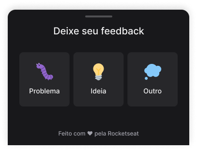

# Feedback Widget

<h1 align="center">
    
</h1>

## 🧪 Tecnologias

Esse projeto foi desenvolvido com as seguintes tecnologias:

- [Expo](https://docs.expo.dev/)
- [React Native](https://reactnative.dev/)
- [TypeScript](https://www.typescriptlang.org/)

## 🚀 Como executar

Clone o projeto e acesse a pasta do mesmo.

```bash
$ git clone https://github.com/BrunoYTanaka/feedwiget-ts
$ cd feedwidget-ts/mobile
```

Para iniciá-lo, siga os passos abaixo:
```bash
# Instalar as dependências
$ npm install ou yarn

# Iniciar o projeto
$ npm start ou yarn start

```
O app estará disponível pelo endereço http://localhost:19002.

Lembrando que é necessário um emulador ou baixar o aplicativo do expo para executar o projeto.

## 💻 Projeto

Feedback Widget é utilizado para deixar feedbacks para os donos dos apps. Todo feedback será armazenado no banco de dados postgress e será enviado por email.

Este é um projeto desenvolvido durante a **[Next Level Week Together](https://nextlevelweek.com/)**, apresentada dos dias 20 a 27 de Junho de 2022.

## 🔖 Layout

Você pode visualizar o layout do projeto através do link abaixo:

- [Layout Mobile](https://www.figma.com/file/Zi6bqEpf2e5C4JkaamsenH/duplicate) 

Lembrando que você precisa ter uma conta no [Figma](http://figma.com/).


## Licença

Este projeto está licenciado sob a Licença MIT - veja o arquivo [LICENSE.md](LICENSE.md) para mais informações.